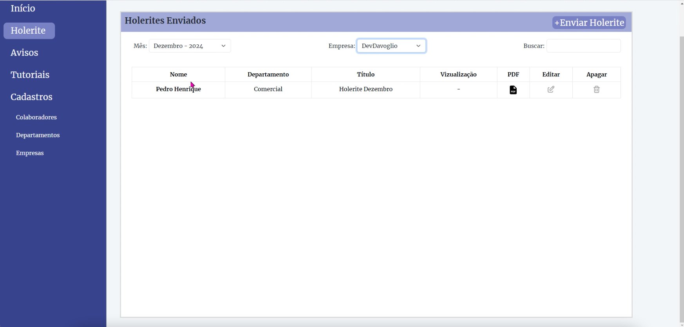
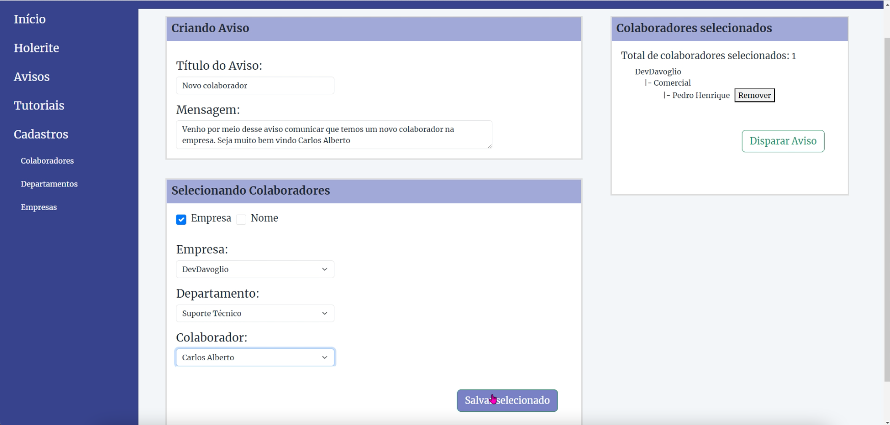
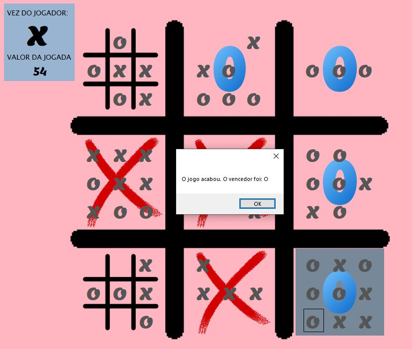

# Curriculo do Portifólio
Aqui está organizado e explicado minhas aplicações profissionais e complementos das atividades com projetos feitos.

## Projetos que fiz na prática

* Projeto Postagem de Holerite e aviso para colaboradores:
  * Site que permite o cadastramento da empresa, dos setores, dos funcionários e seus dados assim como envio de seus holerites e avisos individuais ou gerais.
  * [Link do Projeto](https://github.com/VitorVDavoglio/Projeto-Holerite.git)

  
  

## 
* Projeto Cadastro de novos clientes e análise de vendas:
  * Aplicativo feito para cadastro de novos clientes com página de verificação de dados e análise de vendas para prospecção.
  * 🚧 [Link do Projeto](https://github.com/VitorVDavoglio/Projeto-Vendas-Clientes.git) 🚧

  <table>
    <tr>
      <th>Login</th>
      <th>início de cadastro</th>
      <th>Clientes Cadastrados</th>
    </tr>
    <tr>
      <td></td>
      <td></td>
      <td></td>
    </tr>
  </table>

## 
* Projeto Controle de vendas e prospecção pelo CRM
  * 
  * 🚧 [Link do Projeto](https://github.com/VitorVDavoglio/99CRM.git) 🚧

##
* Software do Jogo da Velha Complexo:
  * Consiste em ampliar a dificuldade do famoso Jogo da Velha tornando cada espaço outro jogo da velha e cada ação pode ajudar ou atrapalhar o oponente.
  * [Link do Projeto](https://github.com/VitorVDavoglio/Jogo-da-Velha-Complexo.git)

  

##
* Software para mapeamento de rotas:
  * Software que utiliza técnicas de programação que busca a rota mais curta para o usuário seguir.
  * [Link do Projeto](https://github.com/VitorVDavoglio/BeamMaps.git)

  

## Projetos que fiz na Faculdade 
* Ao clicar nesse [link]() será exibido a página com mais explicações dos projetos que foram feitos como conclusão do semestre.

  * No primeiro Semestre foi pedido para fazermos um [SITE](https://vitorvdavoglio.github.io/Programacao_Web_Responsiva/Atividade_Pratica/index.html) com os recursos de `HTML` e `CSS` que serviria como propaganda de um hotel.
 
  * Já no segundo Semestre fomos contemplados com a linguagem `PYTHON` e foi feito um [PROGRAMA](Projetos/Python_cpf) que verificaria se o CPF digitado estava correto e poderia existir.
 
  * No terceiro Semestre em pariedade com a matéria Orientação a Objeto utilizamos a linguagem `JAVA` para criar um jogo com tema de preservação ambiental em uma cidade foi feito com inspiração no jogo Zombie Tsunami.

## Certificados de estudo. 

##

