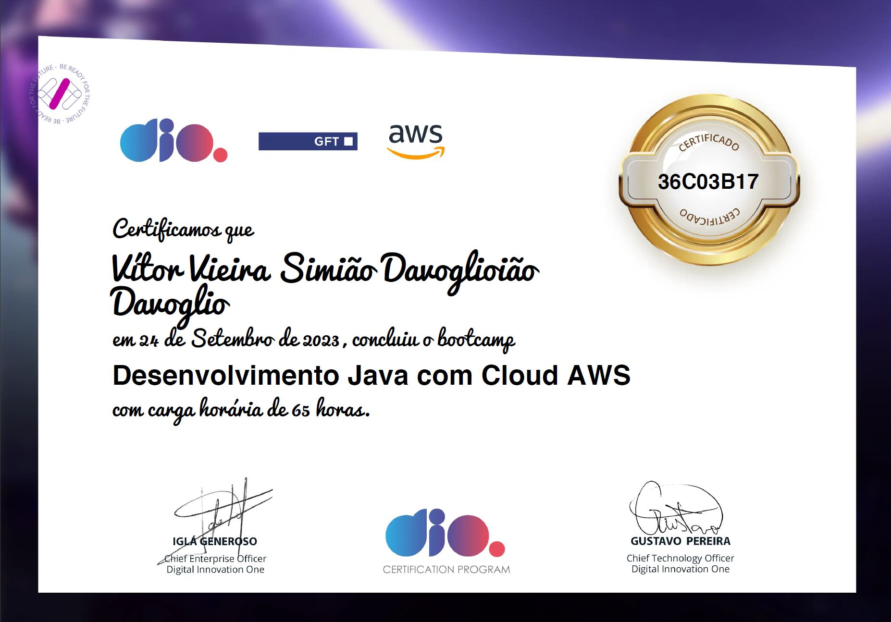
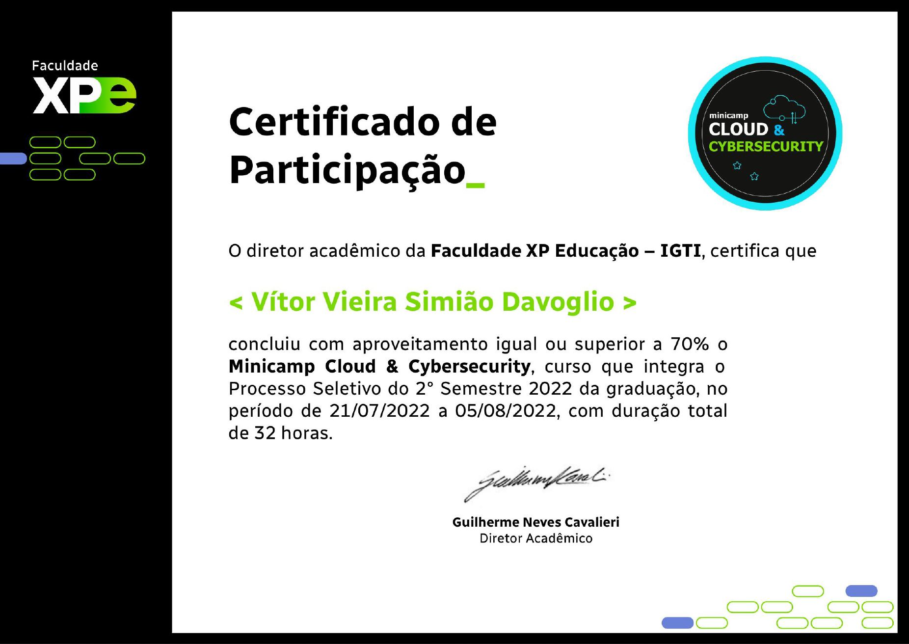

# Curriculo-Portifolio
Aqui está organizado e explicado minhas aplicações profissionais e complementos das atividades com projetos feitos

## Projetos que fiz na Faculdade 
* Ao clicar nesse [link]() será exibido a página com mais explicações dos projetos que foram feitos como conclusão do semestre.

  * No primeiro semestre foi pedido para fazermos um [SITE](https://vitorvdavoglio.github.io/Programacao_Web_Responsiva/Atividade_Pratica/index.html) com os recursos de `HTML` e `CSS` que serviria como propaganda de um hotel.
 
  * Já no segundo semestre fomos contemplados com a linguagem `PYTHON` e foi feito um [PROGRAMA](Projetos/Python_cpf) que verificaria se o CPF digitado estava correto e poderia existir.
 
  * No terceiro Semestre em pariedade com a matéria Orientação a Objeto utilizamos a linguagem `JAVA` para criar um jogo com tema de preservação ambiental em uma cidade foi feito com inspiração no jogo Zombie Tsunami.

## Certificados de estudo. 

##

